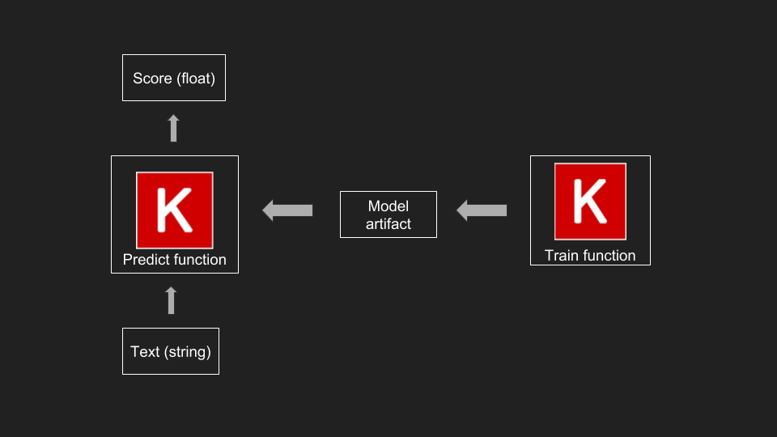
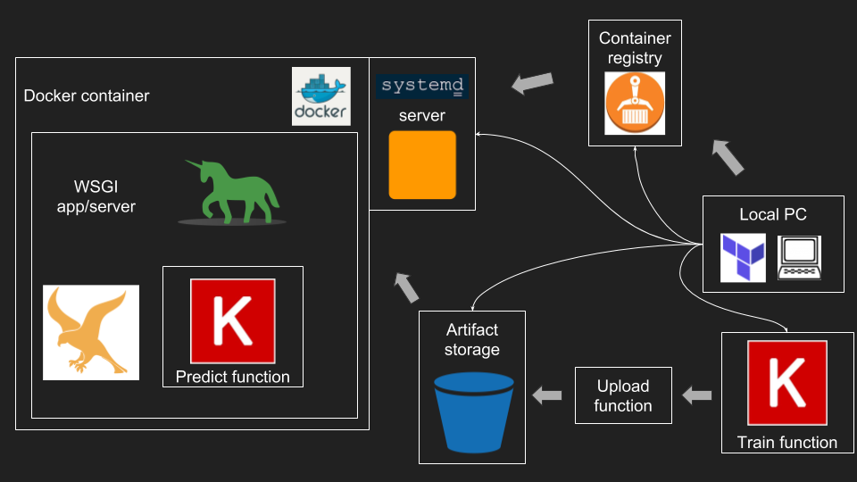

# Deploying a Production Ready Machine Learning API

Madpy (Madison Python) Meetup talk, 4/11/2019

> When it comes to machine learning, most of the research and emphasis is on the development side, but the deployment side can be just as fun. The goal of this talk is go over the basics of deploying a production ready app for serving a machine learning model. I will be using AWS but the ideas generalize. I will demonstrate some basic architectures we use at American Family Insurance. Some familiarity with cloud computing and/or machine learning is helpful but definitely not required.

Links: 
- [Meetup event page](https://www.meetup.com/MadPython/events/258928634/)
- [Github repo](https://github.com/dconathan/madpy-deploy-ml)

## Summary

This repo contains code and configuration for deploying a sentiment text classifier trained using Tensorflow/Keras.  The quickstart section will get you a working version of the model locally.  The next section will detail an architecture for deploying it to the cloud, followed by a tutorial on provisioning and deploying to AWS using Terraform.

Key files/modules:
- [model.py](src/model.py) for code to download data, train/save model, and predict
- [app.py](src/app.py) for the falcon WSGI app that serves the model
- [infra/](infra) for the terraform modules (to provision AWS services)

## Setup and Environment

This tutorial assumes you have [Docker](https://docs.docker.com/) installed and running.

### Python

First clone the repo:
```
git clone https://github.com/dconathan/madpy-deploy-ml.git
cd madpy-deploy-ml
```

This repo uses [pipenv](https://pipenv.readthedocs.io/en/latest/) to set up the virtual environment, and was developed and tested using Python 3.7.  It will probably work with 3.6 too, but no promises.  To create/setup and activate the environment:

```
pipenv sync
pipenv shell
```

### Terraform

For the steps involving provisioning AWS resources, you need [Terraform](https://www.terraform.io/) installed and appropriate AWS credientials.  Check out their [installation guide](https://learn.hashicorp.com/terraform/getting-started/install) and the [Terraform AWS authentication](https://www.terraform.io/docs/providers/aws/index.html#authentication) section for more details (I use environment variables).

> **Please note: DO NOT put your AWS credentials in the `.env` file in this folder.  The `.env` is being tracked by git and you may accidentally expose your credentials to the public. See [this paper](https://www.ndss-symposium.org/ndss-paper/how-bad-can-it-git-characterizing-secret-leakage-in-public-github-repositories/) about this very topic!**

At the time of giving this talk, I am using:

```
$ terraform --version
Terraform v0.11.13
```

### Environment variables

There is a [.env](.env) file that specifies some environment variables that affect how things get named.  It is crucial to update this file with unique names if you are going to do any of the AWS provisioning/deployment steps, but should be fine as is if you are just running/building locally.

## Quickstart

Train a model:
```
python src/main.py train
```

Predict using the model:
```
python src/main.py predict have a nice day!
```

Run tests (`pipenv sync --dev` first if you don't have pytest installed):
```
pytest
```

Start a server running locally that serves the model:
```
gunicorn app:api
```

Call it using `curl`:
```
curl localhost:8000/predict -X POST -H "content-type: application/json" -d '{"text":"hello world"}'
```

## Architecture 

Before you start, one question you need to ask is what kind of use case are you supporting.  These are the kinds of questions you should answer:

   - Do you already have the data you are trying to predict on?  Is it big data?
   - Is the data going to come in large batches or streaming one example at a time?
   - What's the maximum acceptable latency?
   - What requests/second is expected or necessary?
   - What is the budget?

For example, the type of deployment is going to be significantly different for a Netflix-style recommender system (where you can process all your user data offline) vs. a chatbot intent predictor (where near-instantaneous results is crucial for user experience).  You may also want to consider using a *serverless* architecture, which offers different tradeoffs and advantages.

Here we implement a low-volume but high-frequency/low-latency service.  Our target will be in the neighborhood of 10-100 requests/second with the opportunity to scale out if we want to support more.

### This Architecture
#### Model

#### Infrastructure


#### Summary

 - At the core of everything is [model.py](src/model.py)
    - It trains, saves, and uploads the model
    - It has a `predict` function that applies the model
         - It takes a string as an argument and returns a float
 - A simple WSGI [app](src/app.py) serves the model
 - The model code, WSGI app, and environment are packaged into a [Docker image](Dockerfile)
 - AWS infrastructure provisioned using Terraform
   - An [S3 bucket](infra/bucket) provides a persistant location for the model artifact(s)
      - This allows us to run the model anywhere as long as we have access to the bucket
      - The model code is written to automatically download the model from S3 if not found locally
   - A [container registry](infra/container_registry) stores/serves the docker images
      - The Docker image is built locally and uploaded to the registry
   - An [EC2 server](infra/server) instance pulls and runs the image automatically as a systemd service

#### Key Points

 - Infrastructure as code
 - Configure using environment variables for reusability/modularity


## Provisioning and Deployment

First check out the [.env](.env) file, specifically the first section:

```
# define your project and environment
PROJECT_NAME=madpy-test
PROJECT_ENV=dev
```

> **Note:** Make sure you `exit` and `pipenv shell` after you've changed the `.env` file to reflect any changes you've made

Names of all the resources will derive from these variables.  S3 bucket and ECR names must be unique so you will need to change the `PROJECT_NAME` to something new.  The `PROJECT_ENV` variable lets you set up two or more versions of the whole stack if that's needed.

> **Note:** A typical pattern might have you develop in a `PROJECT_ENV=dev` environment, switch to `PROJECT_ENV=qa` for testing, and use `PROJECT_ENV=prod` for a critical, client-facing environment.  Be sure to take advantage of Terraform [workspaces](https://www.terraform.io/docs/state/workspaces.html) for managing multiple states simultaneously.

### S3 bucket

First we need to set up the remote storage for our model artifacts.

Navigate to `infra/bucket/` and look at the [main.tf](infra/bucket/main.tf).

This contains JSON-like code (a "terraform module") for configuring an S3 bucket.

   - The `variable` section declares a variable
      - Here variables are set from the environment variables in our [.env](.env) file
      - If they're not set, terraform will prompt you for their values when you try to deploy
   - The `resource` section declares that we want an S3 bucket with the given name.  
      - Check out the [terraform `aws_s3_bucket` argument reference](https://www.terraform.io/docs/providers/aws/r/s3_bucket.html#argument-reference) for all the allowable arguments
      - The defaults are sane enough for our use case

To provision the bucket using Terraform:

```
terraform init
terraform plan
terraform apply
```

Take a look at the [Terraform CLI documentatoin](https://www.terraform.io/docs/commands/index.html) for details on what these commands are doing, but essentially they are:
   - initializing the directory (only has to be run once)
   - planning the steps needed achieve the state described in the *.tf files
   - applying the steps from the plan

After running, you'll see a `terraform.tfstate`, which is a JSON file with metadata describing the current state of the resources in our module.

You should have your S3 bucket now.  If you have the [AWS CLI](https://aws.amazon.com/cli/) installed, you can look at the output of `aws s3 ls` to see if your bucket shows up.

You should be able to run the `python main/src.py upload` command to upload the model we trained in the [quickstart](#quickstart).


### Container registry

We are going to deploy our model using a Docker container, so we need a repository to store the image.  We're going to set up an [Elastic Container Registry](https://docs.aws.amazon.com/AmazonECR/latest/userguide/what-is-ecr.html), Amazon's service for image repositories.

Navigate to the `infra/container_registry` folder.  The [main.tf](infra/container_registry/main.tf) file is nearly the same as the previous one (again, the defaults are good enough for our use case), but this one has an `output` section.  Terraform lets you declare attributes of your resources as outputs in case you want to use them in external applications.

Here we care about the `repository_url` property of the repository we are creating, so we can upload our Docker image to it.  The value will be printed to the terminal when you `terraform apply`.  You can also run `terraform output` or `terraform output repo_url` anytime to get its value, or even `terraform output -json` to get outputs as JSON (which may be useful in automation).

Apply the same `init`, `plan`, `apply` sequence in this directory to create your ECR repository.  We'll need the URL it generates to upload our Docker image.  Export it to the environment variable `PROJECT_IMAGE`:

```
export PROJECT_IMAGE=$(terraform output repo_url)
```

Now that we've created the image repository, we can build and upload our Docker image.  Navigate back to the top-level `madpy-deploy-ml/` directory and run:

```
$(aws ecr get-login --no-include-email)
docker build . -t $PROJECT_IMAGE --build-arg PROJECT_BUCKET=$PROJECT_BUCKET
docker push $PROJECT_IMAGE
```

 - The first command calls `docker login` with the appropriate AWS credentials so you have permission to push to your private image repository
 - The second command builds the Docker image
   - We are tagging it with the URL of the repository we just created
   - We pass the `PROJECT_BUCKET` environment variable to the image at build time using Docker build args
 - The third command uploads the Docker image to the repo we just created

### Server

Finally we can set up the server that will run our application.

Go to the `infra/server` folder.  The [main.tf](infra/server/main.tf) here is more complicated because there are a lot of moving parts for setting up a server: you need to specify a VPC, security group (firewall exceptions), and give the server appropriate access to the image repository and bucket we set up in the previous steps.

If you're curious about finding more about what each section does and how it's configured, the [Terraform documentation](https://www.terraform.io/docs/providers/aws/index.html) is quite good.

#### Setting up a service

Ideally we set up our EC2 instance so that it installs all prerequisites and runs our application automatically.  We do NOT want to have to SSH to our production instance in order to get it working.

AWS/Terraform lets you provide a `user_data` argument to creating an instance which is a bootstrap script that is run when the instance is created.

Terraform reads the script from the [on_create.tpl](infra/server/on_create.tpl) file, which is a [Terraform `template_file`](https://www.terraform.io/docs/providers/template/d/file.html).

It installs and sets up Docker, pulls our image, and starts a [systemd](https://en.wikipedia.org/wiki/Systemd) service that runs the Docker container.  Using a `template_file` lets us pass Terraform variables like the AWS region and repository url from the previous step.


#### Security

One quick thing I'd like to highlight about the sections involving security (`aws_iam_*`).  For production, it's a good idea to follow the [principle of least privilege](https://en.wikipedia.org/wiki/Principle_of_least_privilege).

For example, the `read_s3_ecr` policy has a statement:
```
actions = [
  "s3:ListBucket",
  "s3:GetObject"
]
resources = [
  "${data.aws_s3_bucket.this.arn}",
  "${data.aws_s3_bucket.this.arn}/*"
]
```

Which grants our instance **read-only** access to our project S3 bucket.  We could have been lazy and had something like this:

```
actions = [
   "s3:*"
]
resources = [
   "*"
]
```

This would give the instance read/write access to ALL of our buckets.  This opens up the possibility of all kinds of unwanted side effects:
   - Our app deleting/overwriting our model
   - Our app deleting/overwriting contents of other buckets
   - If the instance is compromised, an attacker could easily get ALL of our data

With the more restrictive policy, we can do everything we need to do and contain the potential damage by any bugs/attacks.

#### Deployment

To create all the resources is this module, run the same `init`, `plan`, and `apply` commands.  This will take about a minute but you should see the public DNS of the server.  Our app should be running in a few minutes.  Until then we can try hitting our health check:

```
watch curl $(terraform output url)
```

Hopefully in a few minutes, you see the `OK` response.

## Next steps

### Model and app updates and versioning

At some point, you will want to be able to update your app (to change the API) or update your model (retrained using new data perhaps).

As written, you would need to terminate/recreate the instance to update the app (after pushing a new Docker image), or restart the instance to update the model (after uploading a new model to the S3 bucket).

#### App updates

We could change the `ExecStart` in the [on_create.tpl](infra/server/on_create.tpl) to always pull the latest version of the image when starting the service.  This way we'd only need to restart the instance to get the latest version app.

#### Model version

We could modify the `/predict` endpoint and the `predict()` and `get_model()` functions to accept a `version` argument in order to call a specific model.  We could then store several different versions of the model in our S3 bucket.

#### A model registry

Once we have a few models with different versions, it might be good idea to main some kind of model registry that keeps tracks of what models/versions are available, how to call them, and what is their performance like.

### Automation

Every step of this tutorial could be automated using an automation tool like [Jenkins](https://jenkins.io/).  For example, you could set up a webhook that starts a job to automatically run tests and rebuild/push a new Docker image when you push to your master branch.

#### Automatic testing

Once automation is involved, you probably want to add some more qualitative tests to your deployment pipeline.  You want to have some test to ensure your prediction accuracy is not dropping below some threshold, or at least make sure your model is giving sane outputs for a certain set of inputs!


### Scaling

At some point we will need to scale our app.  With the architecture we have, we could set up an [nginx](https://www.nginx.com/) container as a load balancer in front of several clones of our app container.

At some point you should consider using a managed container cluster service like AWS' Elastic Container Service (ECS) or Elastic Kubernetes Service (EKS).  These services have a little bit more overhead to set up, but can simplify the management of your infrastructure and make scaling trivial.
